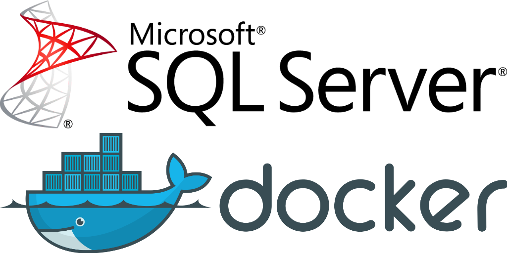

# Acerca del proyecto

El proyecto consiste en dos tablas, una de Tipos de permiso y permisos, está construido utilizando las siguientes tecnologías:

- **Frontend**: ReactJS
- **Backend**: .NET core
- **Base de datos**: SQL Server

## [Documentación Sitio](site.md)

## [Documentación WebAPI](webapi.md)

## [Documentación SQL Server](sql_server.md)

