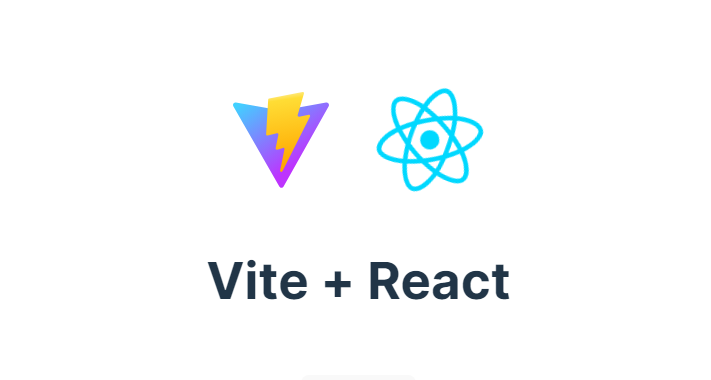

# Ejecución Vite + React

## Archivo de variables

Antes de ejecutar el proyecto en `local`, crear la imagen de `Docker` o a través de `Docker Compose` es importante asegurarse de tener el archivo `.env` en la raíz con las variables de entorno. Ejemplo:

```
VITE_APP_PORT=5000
VITE_WEB_API=http://localhost:8080/api
```

Más información en la sección [Variables de entorno y modos](#variables-de-entorno-y-modos).

## Docker

### Versión para desplegar

Vite generará la versión _distribuible_ del sitio web, para eso hay que ejecutar el siguiente comando

```shell
npm run build
```

Se generará la carpeta **dist** dentro del proyecto (Site), esa carpeta se debe trasladar a la imagen que se generará con el [Dockerfile](./Site/Dockerfile).

### Dockerfile

Creamos la imagen

```shell
docker build --tag reactjs_site ./
```

Creamos un contenedor

```shell
docker run -d --name frontend_reactjs -p 8081:80 reactjs_site
```

El sitio se podrá visualizar en

```
http://localhost:8081/
```

## Docker Compose

Antes de iniciar la ejecución con Docker Compose es importante generar los insumos de Vite como en la sección [Versión para desplegar](#versión-para-desplegar). Esto será reemplazado por la característica de [compilación en varias fases de Docker](https://docs.docker.com/build/building/multi-stage/) y agregado a [Site/Dockerfile](Site/Dockerfile).

La raíz del repositorio tiene incluido un archivo de Docker Compose, [compose.yaml](compose.yaml). Ubicarse en la raíz de todo el proyecto y ejecutar el siguiente comando para levantarlo.

```
docker compose up
```

Descargará las imagenes y crearán los contenedores. Las direcciones quedan de la siguiente manera:

- **Frontend**: http://localhost:8081/
- **Backend**: http://localhost:8080/api/

Cuando todos los recursos estén levantados se puede iniciar a utilizar la aplicación a través de la dirección del _Frontend_.

Para finalizar la ejecución es necesario presionar `Ctrl+C` en la terminal y luevo ejecutar el siguiente comando para apagar y borrar todo

```
docker compose down --rmi all -v --remove-orphans
```

## Local

### Instalar dependencias

Instalar todas las dependencias agregadas en `package.json`

```shell
npm install
```

### Ejecución del proyecto

```shell
npm run dev
```

El sitio se podrá visualizar en

```
http://localhost:5000/
```

# Acerca del proyecto

## Tabla de contenido

- [Crear el proyecto](#crear-el-proyecto)
- [Instalar paquetes](#instalar-paquetes)
- [Variables de entorno y modos](#variables-de-entorno-y-modos)
  - [Archivo `.env`](#archivo-env)
  - [Prefijo predeterminado](#prefijo-predeterminado)
    - [Modificar prefijo predeterminado](#modificar-prefijo-predeterminado)
  - [Archivo `configurations.js`](#archivo-configurationsjs)
- [Prettier](#prettier)
- [ReduxJS y MaterialUI](#reduxjs-y-materialui)
- [React Router Dom](#react-router-dom)

## Crear el proyecto

```shell
$ npm init vite@latest
Need to install the following packages:
create-vite@5.4.0
Ok to proceed? (y) y
✔ Project name: … Site
✔ Package name: … site
✔ Select a framework: › React
✔ Select a variant: › JavaScript + SWC
```

## Instalar paquetes

```shell
cd Site
npm install
```

## Variables de entorno y modos

Según la [documentación](https://vitejs.dev/guide/env-and-mode), Vite posee una forma de exponer las variables de entorno, lo hace a través del objeto especial `import.meta.env`. En ese objeto se puede encontrar el _modo_ en que está corriendo la aplicación, _development_ o _production_, la base desde la que se sirve la aplicación, y otros valores importantes.

### Archivo `.env`

De manera inicial podemos generar un archivo `.env` en la raíz del proyecto y ahí colocar nuestras primeras variables. Creamos un archivo de ejemplo para parametrizar el puerto:

```shell
echo VITE_APP_PORT=5000 >> .env
```

Agregamos la referencia al backend

```shell
echo VITE_WEB_API=http://localhost:8080/api >> .env
```

En este momento el puerto no ha sido modificado, solo hemos creado una nueva variable con el dato que ya puede ser accedido desde cualquier componente de React.

### Prefijo predeterminado

Notar que la variable tiene un [prefijo predefinido](https://vitejs.dev/config/shared-options#envprefix), el valor predeterminado para el uso de las variables es `VITE_` seguido del nombre de la variable.

### Archivo `configurations.js`

Si las variables de entorno se utilizan de forma regada, no podremos tener visible **_todas_** las variables de entorno que tiene el proyecto, esto porque el archivo `.env` no se encuentra en el repositorio. Lo que haremos es crear un archivo _intermedio_ que importará todas las variables de entorno y desde ahí si se podrán exportar al código fuente, éste archivo servirá como referencia para generar nuestro propio `.env`de forma local.
Crear la carpeta de configuración

```shell
cd src
mkdir config
```

Creamos el archivo `configurations.js` en la carpeta _config_

```shell
touch config/configurations.js
```

Se utiliza la sintaxis de los módulos ES para exportar los valores
El contenido inicial del archivo será:

```js
export default {
  APP_PORT: import.meta.env.VITE_APP_PORT,
  WEB_API: import.meta.env.VITE_WEB_API,
};
```

Para definir otro **puerto** de publicación es necesario agregarlo en el archivo de configuración [vite.config.js](vite.config.js). La configuración quedará así:

```js
import { defineConfig, loadEnv } from "vite";
import react from "@vitejs/plugin-react-swc";

// https://vitejs.dev/config/
export default defineConfig(({ mode }) => {
  process.env = { ...process.env, ...loadEnv(mode, process.cwd()) };
  return {
    plugins: [react()],
    server: {
      port: parseInt(process.env.VITE_APP_PORT),
    },
  };
});
```

## Prettier

Agregaremos el paquete [`Prettier`](https://www.npmjs.com/package/prettier) para mantener formateado el código fuente.

```shell
npm install prettier
```

Al archivo [`package.json`](package.json) agregamos los scripts para la verificación y el formateo del código.

```json
{
  ...
  "scripts": {
    "format": "prettier --write \"src/**/*.js\" \"src/**/*.jsx\"",
    "format:check": "prettier --check \"src/**/*.js\" \"src/**/*.jsx\"",
    ...
  }
}
```

Los scripts se ejecutan de la siguiente forma:

```shell
npm run format
npm run format:check
```

## ReduxJS y MaterialUI

Instalamos ReduxJS y Material UI:

```shell
npm install @reduxjs/toolkit react-redux @mui/icons-material @mui/material @emotion/styled @emotion/react
```

Utilizaremos los estados de la aplicación principalmente en Redux, el hook de react `useState` también se podría utilizar pero por orden y centralización se prefirió Redux. Y se utiliza `@reduxjs/toolkit` por la [simplicidad](https://redux-toolkit.js.org/introduction/getting-started). También se utilizarán los componentes de [Material UI](https://mui.com/material-ui/) e iconos.

### Configuración de ReduxJS

Crear la carpeta `store` que contendrá la configuración y estados de la aplicación:

```shell
cd src
mkdir store
```

Creamos el archivo `index.js` en la carpeta _store_

```shell
touch store/index.js
```

El contenido inicial del archivo será:

```js
import { configureStore } from "@reduxjs/toolkit";

export const store = configureStore({});
```

La versión final del archivo se encuentra en [src/store/index.js](src/store/index.js).

Asociamos el `store` a la raíz del proyecto, eso quiere decir que se crea un nuevo componente raíz, `<Provider />`, en la estructura principal definida en el archivo [`main.jsx`](./react_vite_frontend/src/main.jsx).

```js
import React from "react";
import ReactDOM from "react-dom/client";
import App from "./App.jsx";
import "./index.css";
import { store } from "./store/index.js";
import { Provider } from "react-redux";

ReactDOM.createRoot(document.getElementById("root")).render(
  <React.StrictMode>
    <Provider store={store}>
      <App />
    </Provider>
  </React.StrictMode>
);
```

Las llamadas hacia el API RESTful y el manejo de estados de _PermissionType_ y _Permission_ se hará en los archivos [src/store/Permissions/index.js](src/store/Permissions/index.js) y [src/store/PermissionTypes/index.js](src/store/Permissions/index.js).

Para hacer las llamadas hacia el API se utilizará _Axios_ por lo que se debe instalar de la siguiente forma:

```shell
npm install axios
```

Los estados de la aplicación tienen la siguiente estructura:

```
.
├── store
│   ├── Alert
│   │   └── index.js
│   ├── index.js
│   ├── Permissions
│   │   └── index.js
│   └── PermissionTypes
│       └── index.js
```

### Componentes

Crear la carpeta de componentes

```shell
cd src
mkdir components
```

Dentro de la carpeta `components` se encontrarán los componentes ordenados de acuerdo a los módulos que requiera la aplicación. Para este caso se tendrán la carpeta `Permissions` con los datos y formularios de cada tabla, los otros son de uso común en una aplicación web.

```shell
cd components
mkdir Permissions
```

Los componentes que se utilizarán en este proyecto estarán distribuidos de la siguiente forma:

```
.
├── components
│   ├── Common
│   │   └── CustomModal.jsx
│   ├── Permissions
│   │   ├── PermissionForm.jsx
│   │   ├── PermissionsList.jsx
│   │   ├── PermissionTypeForm.jsx
│   │   └── PermissionTypesList.jsx
│   └── Principal
│       └── Principal.jsx
```

## React Router Dom

Instalación

```shell
npm install react-router-dom
```

Se utilizará react-router-dom para el manejo de paths y navegación del proyecto, en este caso solo se tiene una página principal.

```js
const router = createBrowserRouter([
  {
    path: "/",
    element: <Principal />,
  },
]);
```

Más detalles en [src/App.jsx](src/App.jsx)
